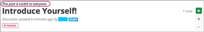
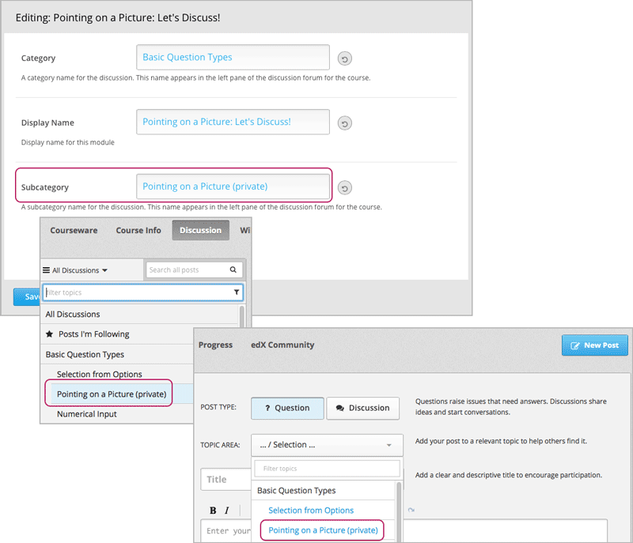

.. _Moderating Discussions for Cohorts:

###################################################
Configuring and Moderating Discussions for Cohorts
###################################################

For students and the moderation staff:

For the moderation staff

.. _:

********************************
Identifying Who Can See a Post 
********************************

In a course with the cohort feature enabled, all posts include a cohort
indicator above the title. This indicator appears after the student or staff
member adds the post. No configuration by the course
team is necessary.

To identify whether a particular discussion topic is configured to support
private interactions for cohort groups, or is open to everyone, the course team
can apply naming conventions to the discussion topics.

==================================
Read the Cohort Indicator in Posts
==================================

Every post includes a sentence to identify whether everyone can see and
contribute to it, or only the members of a specific cohort group.

       the title

.. image:: ../Images/post_visible_cohort.png
 :alt: A discussion topic post with "This post is visible to" and a cohort 
        name

The students in every cohort as well as the discussion admins and moderators
can see this identifier after a post is added. 

=========================================================
Apply Naming Conventions to Content-Specific Topics
=========================================================

All of the content-specific discussion topics that you add to units in Studio
support private conversations for cohorts. You can give students this context
before they add posts to these topics by using an appropriate naming convention
for the Discussion components in your course.

When you edit a Discussion component in Studio, you can include an identifier
like "(private)" or "(small group)" in the **Subcategory** name.

       Studio appears on the dropdown lists of discussion topics in the live
       course

.. I think this may be too busy, and should perhaps just highlight the role of the Subcategory 

When students visit the **Discussion** page, the subcategory name cues the
student that posts to those topics, and the responses and comments made to
them, are private group interactions.

.. note:: All students see the same **Subcategory** name.

To provide a consistent experience for your students, apply the same identifier
to all of the content-specific discussion topics.

For more information, see :ref:`Create a Discussion Component`.

.. _Apply Naming Conventions to CourseWide Topics:

===============================================
Apply Naming Conventions to Course-Wide Topics
===============================================

You can define which of the course-wide discussion topics are open to all
students and which support private group interactions for student cohorts.

You can use naming conventions for your course-wide discussion topics to
distinguish cohort-specific topics from topics that are open to all students.

       dropdown list of discussion topics in the live course

When students visit the **Discussion** page and use the dropdown lists to
select a topic, the topic names indicate who can see the posts, responses, and
comments.

To provide a consistent experience for your students, apply the same identifier
that you use for the content-specific discussion topics to any course-wide
topics that you configured to be private.

For more information, see :ref:`Organizing_discussions` or :ref:`Identifying
Private CourseWide Discussion Topics`.

********************************
Moderating a Course with Cohorts 
********************************

============================================
Community TAs
============================================